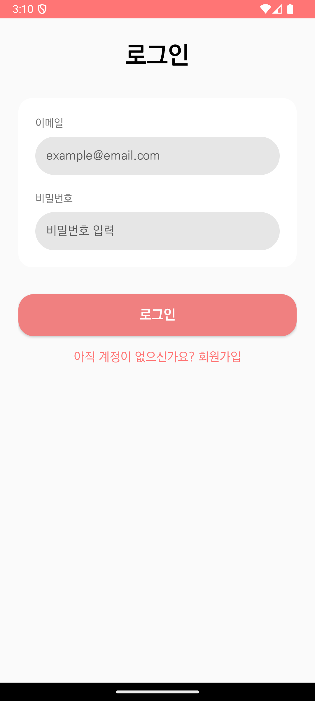
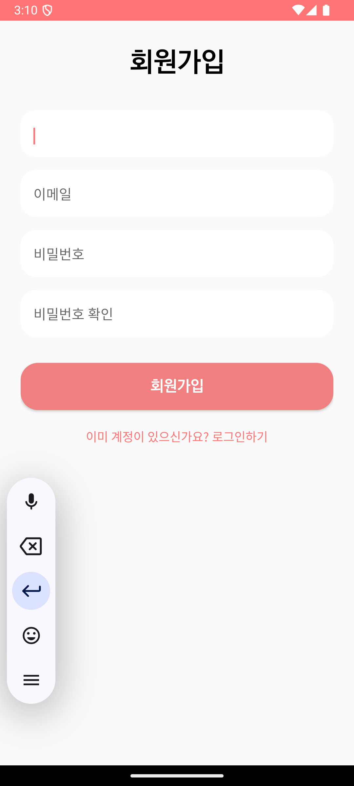
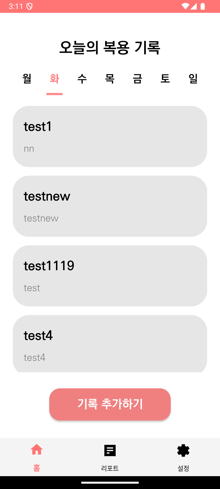
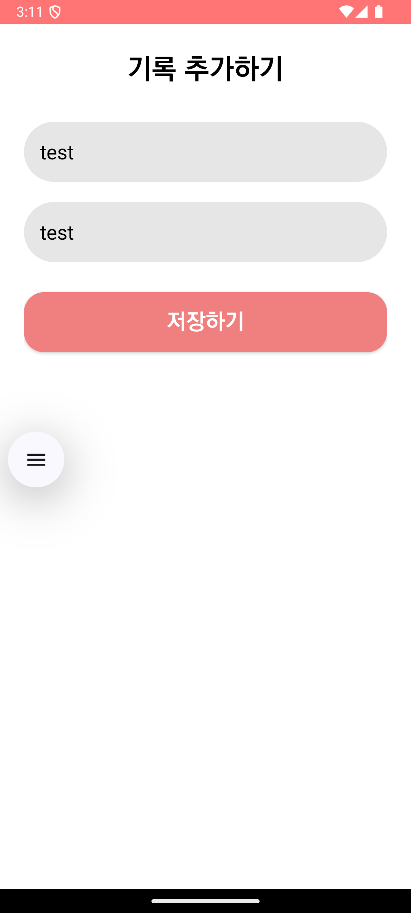

# 💊 Taking

AI 기반 복약 기록 및 주간 건강 리포트 안드로이드 앱

---

## 📱 프로젝트 소개

**Taking**은 사용자의 약 복용 기록을 관리하고,  
일주일 단위로 복약 패턴을 분석하여 **AI 주간 건강 리포트**를 제공하는  
안드로이드 애플리케이션입니다.

단순 기록을 넘어  
- ✔ 복약 습관 점검  
- ✔ 반복되는 증상 인식  
- ✔ 사용자가 스스로 건강 상태를 돌아볼 수 있도록 돕는 것  

을 목표로 개발했습니다.

---

## 🎯 주요 기능

### 🔐 회원 관리
- 회원가입 / 로그인
- 이메일 기반 사용자 인증
- 로그아웃 기능

### 📝 복약 기록
- 오늘의 복용 기록 리스트 확인
- 약 이름 + 증상 입력
- 복용 기록 추가 및 저장

### 📊 주간 리포트
- 선택한 주간(예: `12/10 ~ 12/16`) 복약 요약
- 총 복용 횟수 / 하루 평균 복용 수 제공
- 복용한 약 목록 표시

### 🤖 AI 주간 건강 리포트
- 최근 7일 복약 데이터를 기반으로 AI가 요약 리포트 생성
- **좋았던 점**
- **주의할 점**
- 사용자의 복약 패턴에 맞춘 피드백 제공

### ⚙️ 설정
- 사용자 정보 확인
- 로그아웃
- 알림 설정 (확장 예정)
- 앱 정보 화면

---

## 🖼️ 화면 구성

- 로그인 / 회원가입 화면
- 홈 (오늘의 복용 기록)
- 기록 추가 화면
- 주간 리포트 화면
- 설정 화면

📌 실제 실행 화면은 리포지토리 내 **스크린샷 또는 시연 영상(GIF / MP4)** 을 참고해주세요.

---

## 🛠️ 기술 스택

- **Language**: Kotlin  
- **Platform**: Android  
- **Architecture**: MVVM  
- **UI**: XML Layout  
- **Data**: Local DB (Room 또는 SharedPreferences)  
- **AI 연동**: LLM 기반 텍스트 요약 (프롬프트 설계 중심)

---

## 🤖 AI 주간 리포트 프롬프트 설계

### 1️⃣ 목적 정의

사용자의 최근 7일 복약 기록을 바탕으로  
- 복약 습관을 요약하고  
- 긍정적인 행동을 강화하며  
- 주의가 필요한 부분을 부드럽게 안내하는  

**AI 주간 건강 리포트**를 생성하는 것이 목적입니다.

---

### 2️⃣ 입력 데이터 예시

```json
{
  "period": "2024-12-10 ~ 2024-12-16",
  "totalCount": 2,
  "dailyAverage": 0,
  "records": [
    {
      "medicine": "test",
      "symptom": "test"
    },
    {
      "medicine": "test1",
      "symptom": "nn"
    }
  ]
}
```
---

### 3️⃣ 프롬프트 예시
너는 사용자의 건강 관리를 돕는 AI 헬스 리포트 어시스턴트야.

아래는 사용자의 최근 7일간 약 복용 기록이야.
이 데이터를 바탕으로 주간 건강 리포트를 작성해줘.

조건:
- 친절하고 부드러운 말투를 사용할 것
- 의료 진단처럼 단정적으로 말하지 말 것
- 사용자가 스스로 건강 상태를 돌아볼 수 있도록 도와줄 것
- 아래 형식을 반드시 지켜서 작성할 것

[형식]

📌 AI 주간 건강 리포트

지난 7일 동안 총 {totalCount}개의 약을 복용했어요.

✔ 좋았던 점
- 복약 습관에 대한 긍정적인 피드백
- 기록을 남긴 점에 대한 장점

⚠ 주의할 점
- 복용이 불규칙한 경우 부드럽게 안내
- 반복되는 증상이 있을 경우 병원 상담 권유 (단정 금지)

[복약 기록]
- 약 이름: {medicine}, 증상: {symptom}

## 🖼️ 주요 화면

### 로그인 / 회원가입
<p align="center">
  
  
</p>

### 홈 / 기록
<p align="center">
  
  
</p>

### 설정
<p align="center">
  
</p>


